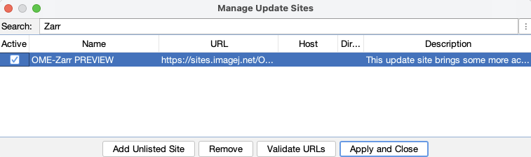

[](https://github.com/BioImageTools/ome-zarr-fiji-java/actions/workflows/build.yml)
[](https://opensource.org/licenses/BSD-2-Clause)
[](https://sonarcloud.io/summary/overall?id=BioImageTools_ome-zarr-fiji-java)
[](https://sonarcloud.io/summary/overall?id=BioImageTools_ome-zarr-fiji-java)

# About

This repo is currently primarily only a Fiji Drag & Drop handler for OME-Zarrs.

If the dropped target is not recognized as a **OME-Zarr v0.3 - v0.5** resource, it does nothing.

# Features

## Drag & Drop of OME-Zarrs from local folders into Fiji

There are several options for what Fiji can do after dragging & dropping an OME-Zarr folder. 

Users can select the **default drag & drop behavior** via `Plugins -> OME-Zarr -> Drag & Drop behavior`

The options are:
  * Open the highest available single-resolution image in ImageJ.
  * Open a matching single-resolution image in ImageJ (**initial default**). Users can preset a maximum image width, and Fiji will open the highest available single-resolution image that is not larger than the preset width. This is useful for avoiding the loading and opening of excessively large images. Fiji simply chooses an appropriately sized level from the resolution pyramids (multiscales) of the dropped OME-Zarr.
  * Open as a multi-resolution source in BigDataViewer. This is useful for large OME-Zarrs. Channel names, colors, contrast limits, and the time point are automatically extracted from the OME-Zarr metadata, if available.
  * Show a [**dialog**](#dialog-options) with all available opening options.

Note: [BigDataViewer](https://imagej.net/plugins/bdv/) is part of Fiji, so there's no need to install anything extra. It is an image(s) viewer especially designed for chunk-based, multiresolution data, designed around the principle of loading only pixels that are needed for the current display of the image(s). It is thus suitable for OME-Zarr datasets and easily handles even the huge ones.

## Dialog options

From top left to bottom right:

* Open the N5 import dialog at the position of the dropped OME-Zarr. This lists resolution levels found in the OME-Zarr, allowing users to choose one and possibly even crop it and finally open it in the ImageJ window.
* Open the N5 viewer dialog at the position of the dropped OME-Zarr. This also lists resolution levels found in the OME-Zarr, allowing users to choose one or the full pyramid and have it opened in the BigDataViewer.
* Directly open a **single-resolution** image in **ImageJ**, which best matches the preferred width in the user settings.
* Directly Open **multi-resolution** image in **BigDataViewer**.
* Run a [pre-defined script](#scriplet-support) (e.g., a macro) while passing to it the path to the dropped OME-Zarr. This way, the user can define her own action.
* Open a web browser pointing to this [Readme](https://github.com/BioImageTools/ome-zarr-fiji-java) file.


## Supported OME-Zarr versions

* [OME-Zarr v0.5](https://ngff.openmicroscopy.org/0.5/index.html) (Zarr v3)
* [OME-Zarr v0.4](https://ngff.openmicroscopy.org/0.4/index.html) (Zarr v2)
* ~~OME-Zarr v0.3 (Zarr v2)~~ (currently not supported)
* Supports 2D (xy) to 5D (xyzct) images, or any subsets of the latter.

## Dual dataset view

* Fiji memorizes the full context of a drag & dropped OME-Zarr. That said, even if the OME-Zarr is opened as a particular resolution in ImageJ via drag & drop, one can still open it in BigDataViewer using all resolution pyramids (via `Plugins -> OME-Zarr ->Plugins > OME-Zarr > Open Current Zarr Image in BigDataViewer`).
* ~~Or the opposite, even if the dropped OME-Zarr has right away landed in BigDataViewer, it is possible to display a particular resolution of it as Dataset in ImageJ.~~ (not yet supported)
* To sum it up, once OME-Zarr is in Fiji, users don't have to drop it again to display it differently. This is a great way to save RAM (memory) on your computer.

## Multi-resolution vs. single-resolution

* Users can drag & drop a top-level OME-Zarr folder, which contains a multi-resolution dataset. It will be opened as multi-resolution data.
* Drag & dropping a subfolder of the top-level OME-Zarr folder (i.e. single-resolution data) is currently not supported.

## Read channel information from OME-Zarr metadata

* Works only when a multi-resolution OME-Zarr is drag & dropped and opened in BigDataViewer.
* The channel names, colors, and contrast limits and their active/inactive state are automatically extracted from the OME-Zarr metadata, if available. The time point is also automatically set to the time point specified in the metadata, if available.

## Reader Backend

* The reading of OME-Zarrs is done via the [N5 library](https://github.com/saalfeldlab/n5).
* We plan to also support reading through [zarr-java](https://github.com/zarr-developers/zarr-java).

## Scriplet support

* Users can run a script on the OME-Zarr. The script resource can be a file and can be set in the `Plugins -> OME-Zarr -> Preset Drag & Drop User Script` menu.
* If no script is set, the script editor opens with a default script.

# Example data

* There are some OME-Zarr example datasets in the image data repository. You can download them from [here](https://idr.github.io/ome-ngff-samples/) to your local machine to test the drag & drop.

# Availability

## Fiji Update Site

Enable the the Fiji update site [OME-Zarr-PREVIEW](https://sites.imagej.net/OME-Zarr-PREVIEW/) in the `Help -> Update -> Manage Update Sites`:



## Manual installation

Check out the repo and compile with:

```
mvn clean package
```

and place the resulting `.jar` file into your `Fiji.app/jars` folder.

You also need to copy the following `.jar` files to your `Fiji.app/jars` folder (and delete the older versions, if they are present):

* [n5-4.0.0-alpha-11](https://maven.scijava.org/repository/releases/org/janelia/saalfeldlab/n5/4.0.0-alpha-11/n5-4.0.0-alpha-11.jar)
* [n5-aws-s3-4.4.0-alpha-9](https://maven.scijava.org/repository/releases/org/janelia/saalfeldlab/n5-aws-s3/4.4.0-alpha-9/n5-aws-s3-4.4.0-alpha-9.jar)
* [n5-blosc-2.0.0-alpha-4](https://maven.scijava.org/repository/releases/org/janelia/saalfeldlab/n5-blosc/2.0.0-alpha-4/n5-blosc-2.0.0-alpha-4.jar)
* [n5-google-cloud-5.2.0-alpha-7](https://maven.scijava.org/repository/releases/org/janelia/saalfeldlab/n5-google-cloud/5.2.0-alpha-7/n5-google-cloud-5.2.0-alpha-7.jar)
* [n5-hdf5-2.3.0-alpha-6](https://maven.scijava.org/repository/releases/org/janelia/saalfeldlab/n5-hdf5/2.3.0-alpha-6/n5-hdf5-2.3.0-alpha-6.jar)
* [n5-ij-4.5.0-alpha-7](https://maven.scijava.org/repository/releases/org/janelia/saalfeldlab/n5-ij/4.5.0-alpha-7/n5-ij-4.5.0-alpha-7.jar)
* [n5-imglib2-7.1.0-alpha-7](https://maven.scijava.org/repository/releases/org/janelia/saalfeldlab/n5-imglib2/7.1.0-alpha-7/n5-imglib2-7.1.0-alpha-7.jar)
* [n5-universe-2.4.0-alpha-8](https://maven.scijava.org/repository/releases/org/janelia/saalfeldlab/n5-universe/2.4.0-alpha-8/n5-universe-2.4.0-alpha-8.jar)
* [n5-zarr-2.0.0-alpha-7](https://maven.scijava.org/repository/releases/org/janelia/saalfeldlab/n5-zarr/2.0.0-alpha-7/n5-zarr-2.0.0-alpha-7.jar)
* [n5-zstandard-2.0.0-alpha-4](https://maven.scijava.org/repository/releases/org/janelia/n5-zstandard/2.0.0-alpha-4/n5-zstandard-2.0.0-alpha-4.jar)

Beyond that, you need to copy this extra `.jar` files to your `Fiji.app/jars` folder:
* [n5-viewer_fiji-6.2.0-alpha-5](https://maven.scijava.org/repository/releases/org/janelia/saalfeldlab/n5-viewer_fiji/6.2.0-alpha-5/n5-viewer_fiji-6.2.0-alpha-5.jar)
* [s3](https://repo1.maven.org/maven2/software/amazon/awssdk/s3/2.30.10/s3-2.30.10.jar)
* [auth](https://repo1.maven.org/maven2/software/amazon/awssdk/auth/2.30.10/auth-2.30.10.jar)
* [annotations](https://repo1.maven.org/maven2/software/amazon/awssdk/annotations/2.30.10/annotations-2.30.10.jar)
* [aws-core](https://repo1.maven.org/maven2/software/amazon/awssdk/aws-core/2.30.10/aws-core-2.30.10.jar)
* [identity-spi](https://repo1.maven.org/maven2/software/amazon/awssdk/identity-spi/2.30.10/identity-spi-2.30.10.jar)
* [sdk-core](https://repo1.maven.org/maven2/software/amazon/awssdk/sdk-core/2.30.10/sdk-core-2.30.10.jar)
* [utils](https://repo1.maven.org/maven2/software/amazon/awssdk/utils/2.30.10/utils-2.30.10.jar)
* [regions](https://repo1.maven.org/maven2/software/amazon/awssdk/regions/2.30.10/regions-2.30.10.jar)
* [http-client-spi](https://repo1.maven.org/maven2/software/amazon/awssdk/http-client-spi/2.30.10/http-client-spi-2.30.10.jar)
* [profiles](https://repo1.maven.org/maven2/software/amazon/awssdk/profiles/2.30.10/profiles-2.30.10.jar)
* [retries-spi](https://repo1.maven.org/maven2/software/amazon/awssdk/retries-spi/2.30.10/retries-spi-2.30.10.jar)
* [endpoints-spi](https://repo1.maven.org/maven2/software/amazon/awssdk/endpoints-spi/2.30.10/endpoints-spi-2.30.10.jar)
* [http-auth-spi](https://repo1.maven.org/maven2/software/amazon/awssdk/http-auth-spi/2.30.10/http-auth-spi-2.30.10.jar)

# History

* 2025: Moved under this github organization
  from [previous URL https://github.com/xulman/ome-zarr-fiji-ui](https://github.com/xulman/ome-zarr-fiji-ui). Code state
  is [here](https://github.com/BioImageTools/ome-zarr-fiji-java/releases/tag/ome-zarr-fiji-java-0.2.0).
* 2024: Project revamped and based solely on [the suite of libs around the N5](https://github.com/saalfeldlab/n5).
* 2024: [OME-NGFF Workflows Hackathon 2024](https://biovisioncenter.notion.site/OME-NGFF-Workflows-Hackathon-2024-dde32a032adf49b4a53b4b014586b678)
in Zurich.
* 2024: [CZI grant about "OME-Zarr Support for Java/Fiji"](https://chanzuckerberg.com/eoss/proposals/?cycle=6) landed
  at [CEITEC](https://www.ceitec.eu/).
* 2023: Changes in the [scijava land](https://github.com/scijava) towards more generic drag & drop handlers.
* 2022: It started at
  the ["Fiji + NGFF Hackathon" in Prague](https://forum.image.sc/t/fiji-ngff-hackathon-sep-2022-prague-cze/69191). Code
  state
  is [here](https://github.com/BioImageTools/ome-zarr-fiji-java/releases/tag/2022-Prague-hackathon) and version with
  revived code demo
  is [here](https://github.com/BioImageTools/ome-zarr-fiji-java/releases/tag/revived-prague-code-demo).

# Outlook

This is a brief outline of what [@xulman](https://github.com/xulman/) would
like to have in Fiji so that the usual Fiji pipelines (meaning the standard
ImageJ macros, Jython scripts, and even GUI-operated plugins) could work with
Zarrs and benefit from their chunk-based nature. It is greatly inspired by his
[previous work on DataStore](https://github.com/fiji-hpc/hpc-datastore/), which
is essentially [a suite of Fiji plugins](https://github.com/fiji-hpc/hpc-datastore/blob/master/doc/DESCRIPTION.md#clients) to manage 
(create, modify and delete full datasets, read and write images or
even their chunks) [a http-servered N5 datasets](https://github.com/fiji-hpc/hpc-datastore/blob/master/doc/DESCRIPTION.md).

So, we basically need a suite of Fiji (in fact scijava) plugins that (are
“headless” and) all of them would take a URI to some NGFF data plus specific
parameters depending on a particular function/purpose of a plugin. Examples are
a query plugin, that tells how many time points are available at a given URI,
or how many channels are available, or a plugin that can read a full image at a
given time point and a given channel from URI etc. Using these, it is easy to
construct e.g. a for-loop over all time points to process an image (at variable
time point and fixed particular channel) one after another. To optimize the
work with a particular URI, a scijava service (we could call it `NgffService`)
should work in conjunction with these plugins. Note that a scijava service is a
singleton object that lives uninterruptedly within Fiji; it is opened and
closed automatically with Fiji. That way, the commands/plugins are “routed”
through the `NgffService`, which could implement caching (with time-limited
memory) so that e.q. repetitive queries will need not to inspect/talk to the
URI-pointed place (e.g. folder, or remote resource); only the first query will
be “expensive” in this way. At the heart should be a public Java API —
interfaces. Currently, the first implementation is planned using the
[n5 library](https://github.com/saalfeldlab/n5).
The `NgffService` should wrap around these interfaces.

The plugins would basically outsource their work to the `NgffService`,
and they could look roughly like this:

```
@Plugin(type = Command.class, menuPath = "Plugins>OME-Zarr>Read Image")
public class OmeZarrReadImage implements Command {
	@Parameter
	NgffService ngff;

	@Parameter
	String URI;

	/* More params specifying which image to read in particular */

	@Parameter(type = ItemIO.OUTPUT)
	Dataset ds;

	@Override
	public void run() {
		Img<?> img = ngff.read(URI, /* params */);
		//create 'ds' around the obtained 'img'
		//plus the usual 'try-catch', you know ;-)
	}
}
```

Such plugins are directly available via Fiji menus, are (or can be made)
macro recordable, accessible in the standard ImageJ macros and Jython scripts;
the `NgffService` can be also directly accessible in the Jython scripts. In
fact, these are cheap “side-effects” of the great [scijava universe](https://github.com/scijava).

The first version is expected to be delivered in 2025.
