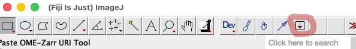
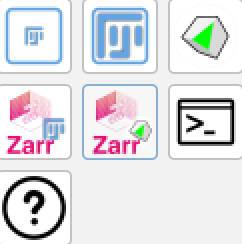
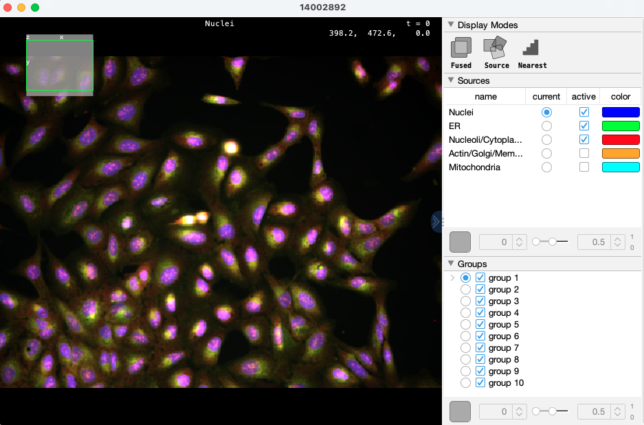
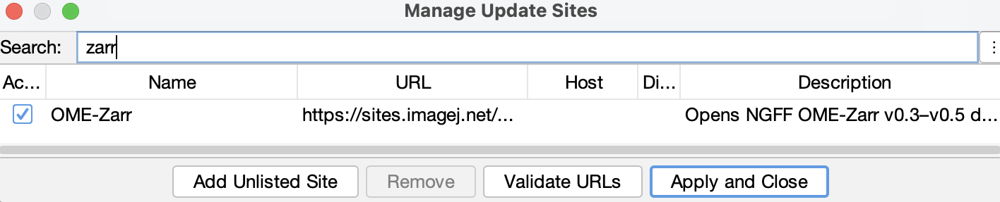

[](https://github.com/BioImageTools/ome-zarr-fiji-java/actions/workflows/build.yml)
[](https://opensource.org/licenses/BSD-2-Clause)
[](https://doi.org/10.5281/zenodo.19567191)
[](https://sonarcloud.io/summary/overall?id=BioImageTools_ome-zarr-fiji-java)
[](https://sonarcloud.io/summary/overall?id=BioImageTools_ome-zarr-fiji-java)

# About

This repo is currently primarily a Fiji Drag & Drop / Copy & Paste / FIJI links handler for OME-Zarrs.

If the dropped / pasted / linked target is not recognized as a **OME-Zarr v0.3 - v0.5** resource, it does nothing.

# Features

### Drag & Drop of local OME-Zarr folders and URIs

There are several options for what Fiji can do after drag & drop / copy & paste:

Users can select the **default opening behavior** via
`Plugins -> OME-Zarr -> Settings -> Opening behavior settings`

The options are:

* Open the highest available single-resolution image in ImageJ.
* Open a matching single-resolution image in ImageJ (**initial default**). Users can preset a maximum image width, and
  Fiji will open the highest available single-resolution image that is not larger than the preset width. This is useful
  for avoiding the loading and opening of excessively large images. Fiji simply chooses an appropriately sized level
  from the resolution pyramids (multiscales) of the dropped OME-Zarr.
* Open as a multi-resolution source in BigDataViewer. This is useful for large OME-Zarrs. Channel names, colors,
  contrast limits, and the time point are automatically extracted from the OME-Zarr metadata, if available.
* Show a [**dialog**](#dialog-options) with all available opening options.

Note: [BigDataViewer](https://imagej.net/plugins/bdv/) is part of Fiji, so there's no need to install anything extra. It
is an image(s) viewer especially designed for chunk-based, multiresolution data, designed around the principle of
loading only pixels that are needed for the current display of the image(s). It is thus suitable for OME-Zarr datasets
and easily handles even the huge ones.

### Copy & Paste of OME-Zarr URIs (local folder, http, https, s3)

* Supports local paths, http(s) URLs, and `s3://` URIs
    * Public (anonymous) S3 buckets work out of the box, e.g.
      `s3://janelia-cosem-datasets/jrc_mus-choroid-plexus-3/jrc_mus-choroid-plexus-3.zarr/recon-1/em/fibsem-uint8`.
    * Private buckets use your ambient AWS credentials (environment variables, `~/.aws/credentials`,
      instance profile, etc.); if those are absent, access falls back to anonymous.
    * The AWS region defaults to `us-east-1`.
* Three entry points:
    * Paste with `CTRL` / `CMD` / `SHIFT` + `V` (requires FIJI latest)
    * Paste via menu: Plugins -> OME-Zarr -> Paste OME-Zarr URI
    * Paste via button in FIJI: 

### FIJI links (`fiji://`)

A `fiji://` link on a web page opens an OME-Zarr straight in a (running) Fiji, honoring the same opening behavior as
drag
& drop and paste. Register the scheme once via `Edit -> Options -> Desktop...`, then a link such as

```
fiji://open/url?p=https://livingobjects.ebi.ac.uk/idr/zarr/v0.5/idr0033A/BR00109990_C2.zarr/0
```

opens that IDR dataset. Use `open/file?p=` for a local path and `open/source?p=` to let Fiji detect the source type.
`s3://` targets do **not** work through links — paste those instead (see above).

See [doc/fiji-links-demo.html](https://htmlpreview.github.io/?https://raw.githubusercontent.com/BioImageTools/ome-zarr-fiji-java/main/doc/fiji-links-demo.html)
for a page with clickable examples of each form.

### Dialog options



#### Top row:

* Open the N5 import dialog at the position of the dropped OME-Zarr. This lists resolution levels found in the OME-Zarr,
  allowing users to choose one and possibly even crop it and finally open it in the ImageJ window.
* Directly open a **single-resolution** image in **ImageJ**, which best matches the preferred width in the user
  settings.
* Run a [pre-defined script](#scriplet-support) (e.g., a macro) while passing to it the path to the dropped OME-Zarr.
  This way, the user can define her own action.

#### Bottom row:

* Open the N5 viewer dialog at the position of the dropped OME-Zarr. This also lists resolution levels found in the
  OME-Zarr, allowing users to choose one or the full pyramid and have it opened in the BigDataViewer.
* Directly Open **multi-resolution** image in **BigDataViewer**.
* Open a web browser pointing to this [Readme](https://github.com/BioImageTools/ome-zarr-fiji-java) file.

## Supported OME-Zarr versions

* [OME-Zarr v0.5](https://ngff.openmicroscopy.org/0.5/index.html) (Zarr v3)
* [OME-Zarr v0.4](https://ngff.openmicroscopy.org/0.4/index.html) (Zarr v2)
* [OME-Zarr v0.3](https://ngff.openmicroscopy.org/0.3/index.html) (Zarr v2)
* Supports 2D (xy), 3D (xyc, xyt, xyz), 4D (xyct, xyzc, xyzt) and 5D (xyzct) images.

## Dual dataset view

* Fiji memorizes the full context of a drag & dropped / copy & pasted OME-Zarr. That said, even if the OME-Zarr is
  opened as a particular resolution in ImageJ via drag & drop / copy & paste, one can still open it in BigDataViewer
  using all resolution pyramids (via `Plugins -> OME-Zarr -> Open Current Zarr Image in BigDataViewer`).
* Or the opposite, even if the dropped / pasted OME-Zarr has right away landed in BigDataViewer, it is possible to
  display a particular resolution of it as Dataset in ImageJ (via `Plugins > OME-Zarr > Open Resolution Level...`).
  Images which support swithing resolutions are displayed carry `(R)` in their name to indicate this property.
* To sum it up, once OME-Zarr is in Fiji, users don't have to drop / paste it again to display it differently. This is a
  great way to save RAM (memory) on your computer.

## Multi-resolution vs. single-resolution

* Users can drag & drop / copy & paste a top-level OME-Zarr folder, which contains a multi-resolution dataset. It will
  be opened as multi-resolution data.
* Users can also drag & drop / copy & paste a subfolder of the top-level OME-Zarr folder (i.e., single-resolution data).

## Read channel information from OME-Zarr metadata

* The channel names, colors, and contrast limits and their active/inactive state are automatically extracted from the
  OME-Zarr metadata, if available. The time point is also automatically set to the time point specified in the metadata,
  if available.
* Works only when a multi-resolution OME-Zarr is drag & dropped / copy & pasted and opened in BigDataViewer.



## Reader Backend

We support two backends for reading OME-Zarrs. Users can choose between the two via the
`Plugins -> OME-Zarr -> Settings -> Open Behavior settings` menu.

* [Zarr-java](https://github.com/zarr-developers/zarr-java) (default)
    * may be a bit quicker when opening remote resources.
    * only supports OME-Zarr v0.4 and v0.5, not v0.3.
* [N5 library](https://github.com/saalfeldlab/n5)
    * alternative, and the only one that reads OME-Zarr v0.3.

## Scriplet support

* Users can run a script on the OME-Zarr. The script resource can be a file and can be set in the
  `Plugins -> OME-Zarr -> Settings -> User Script Settings` menu.
* If no script is set, the script editor opens with a default script.

# Known issues

* Reading of OME-Zarrs version <= 0.2 is not supported. With the zarr-java backend, only OME-Zarr v0.4 and v0.5 are
  supported, not v0.3.
* In FIJI stable, the [N5 backend](#reader-backend) does not work: the N5 jars shipped there are older than this plugin
  needs. Updating those jars by hand is possible (see [manual installation](#n5-backend)) but breaks other plugins
  that depend on N5, e.g. **BigStitcher**. Use the default zarr-java backend, which also means no OME-Zarr v0.3 on FIJI
  stable.
* In FIJI stable, there is no support for s3 stores. Please use FIJI latest.
* With FIJI stable, OME-Zarrs that use Blosc compression cannot be opened on MacOS. Please use FIJI latest, if you
  encounter this issue. Cf. [FIJI downloads](https://imagej.net/software/fiji/downloads).
* In FIJI stable, Pasting a URI via `CMD` / `SHIFT` / `CTRL` + `V` is not supported. Please use FIJI latest.
* In FIJI stable, FIJI Links are not supported.

# Example data

* There are some OME-Zarr example datasets in the image data repository. You can download them
  from [here](https://idr.github.io/ome-ngff-samples/) to your local machine to test the drag & drop.

# Availability

## Fiji Update Site

Enable the the Fiji update site [OME-Zarr-PREVIEW](https://sites.imagej.net/OME-Zarr-PREVIEW/) in the
`Help -> Update -> Manage Update Sites`:



## Manual installation

Check out the repo and compile with:

```
mvn clean package
```

All jars mentioned below go into your Fiji installation's `jars` folder, unless noted otherwise.

The build is a multi-module reactor and produces five jars — one per module. Copy **all five** into that `jars` folder:

* `ome-zarr-imglib2/target/ome-zarr-imglib2-<version>.jar`
* `ome-zarr-n5/target/ome-zarr-n5-<version>.jar`
* `ome-zarr-zarrjava/target/ome-zarr-zarrjava-<version>.jar`
* `ome-zarr-fiji/target/ome-zarr-fiji-<version>.jar`
* `ome-zarr-fiji-ui/target/ome-zarr-fiji-ui-<version>.jar`

### Third-party jars

On top of those five, a number of third-party `.jar` files are needed. Which ones depends on the
[reader backend](#reader-backend) you want to use:

* **N5 backend** needs the N5 library stack (`n5`, `n5-universe`, `n5-zarr`) plus the Fiji
  plugin `n5-viewer_fiji`.
    * **Fiji-Latest** ships these artifacts, so there is usually nothing to do.
    * **Fiji-Stable** ships older versions that have to be updated to the ones listed below. Be aware that other Fiji
      plugins depend on N5 as well, e.g. **BigStitcher** — so updating the N5 jars in a Fiji-Stable installation may
      break them. If you can, use Fiji-Latest, or keep a separate Fiji installation for OME-Zarr work.
* **zarr-java backend** (the default) needs `zarr-java` 0.1.3 and two of its dependencies (the Blosc codec and a
  Jackson module), none of which Fiji ships.

#### N5 backend

* [n5-4.0.1](https://maven.scijava.org/repository/releases/org/janelia/saalfeldlab/n5/4.0.1/n5-4.0.1.jar)
* [n5-aws-s3-5.0.1](https://maven.scijava.org/repository/releases/org/janelia/saalfeldlab/n5-aws-s3/5.0.1/n5-aws-s3-5.0.1.jar)
* [n5-blosc-2.0.0](https://maven.scijava.org/repository/releases/org/janelia/saalfeldlab/n5-blosc/2.0.0/n5-blosc-2.0.0.jar)
* [n5-google-cloud-6.0.1](https://maven.scijava.org/repository/releases/org/janelia/saalfeldlab/n5-google-cloud/6.0.1/n5-google-cloud-6.0.1.jar)
* [n5-hdf5-3.0.0](https://maven.scijava.org/repository/releases/org/janelia/saalfeldlab/n5-hdf5/3.0.0/n5-hdf5-3.0.0.jar)
* [n5-ij-5.0.0](https://maven.scijava.org/repository/releases/org/janelia/saalfeldlab/n5-ij/5.0.0/n5-ij-5.0.0.jar)
* [n5-imglib2-8.0.0](https://maven.scijava.org/repository/releases/org/janelia/saalfeldlab/n5-imglib2/8.0.0/n5-imglib2-8.0.0.jar)
* [n5-universe-3.0.2](https://maven.scijava.org/repository/releases/org/janelia/saalfeldlab/n5-universe/3.0.2/n5-universe-3.0.2.jar)
* [n5-zarr-2.0.1](https://maven.scijava.org/repository/releases/org/janelia/saalfeldlab/n5-zarr/2.0.1/n5-zarr-2.0.1.jar)
* [n5-zstandard-2.0.0](https://maven.scijava.org/repository/releases/org/janelia/n5-zstandard/2.0.0/n5-zstandard-2.0.0.jar)
* [n5-viewer_fiji-6.2.0](https://maven.scijava.org/repository/releases/org/janelia/saalfeldlab/n5-viewer_fiji/6.2.0/n5-viewer_fiji-6.2.0.jar) —
  goes into `plugins`, not `jars`, because it is itself a Fiji plugin

#### zarr-java backend

* [zarr-java-0.1.3](https://repo1.maven.org/maven2/dev/zarr/zarr-java/0.1.3/zarr-java-0.1.3.jar)
* [blosc-java-0.3-1.21.6](https://repo1.maven.org/maven2/com/scalableminds/blosc-java/0.3-1.21.6/blosc-java-0.3-1.21.6.jar) —
  dependency of `zarr-java` (Blosc codec)
* [jackson-datatype-jdk8-2.20.0](https://repo1.maven.org/maven2/com/fasterxml/jackson/datatype/jackson-datatype-jdk8/2.20.0/jackson-datatype-jdk8-2.20.0.jar) —
  dependency of `zarr-java`

Delete older versions of an artifact when you add a newer one.

Note that two options of the [dialog](#dialog-options) — the ones opening the **N5 Importer** and the **N5 Viewer** —
are implemented using `n5-ij` and `n5-viewer_fiji`, so the N5 jars are also needed when the zarr-java
backend is selected.

# History

* 2025: Moved under this github organization
  from [previous URL https://github.com/xulman/ome-zarr-fiji-ui](https://github.com/xulman/ome-zarr-fiji-ui). Code state
  is [here](https://github.com/BioImageTools/ome-zarr-fiji-java/releases/tag/ome-zarr-fiji-java-0.2.0).
* 2024: Project revamped and based solely on [the suite of libs around the N5](https://github.com/saalfeldlab/n5).
* 2024:
  [OME-NGFF Workflows Hackathon 2024](https://biovisioncenter.notion.site/OME-NGFF-Workflows-Hackathon-2024-dde32a032adf49b4a53b4b014586b678)
  in Zurich.
* 2024: [CZI grant about "OME-Zarr Support for Java/Fiji"](https://chanzuckerberg.com/eoss/proposals/?cycle=6) landed
  at [CEITEC](https://www.ceitec.eu/).
* 2023: Changes in the [scijava land](https://github.com/scijava) towards more generic drag & drop handlers.
* 2022: It started at
  the ["Fiji + NGFF Hackathon" in Prague](https://forum.image.sc/t/fiji-ngff-hackathon-sep-2022-prague-cze/69191). Code
  state is [here](https://github.com/BioImageTools/ome-zarr-fiji-java/releases/tag/2022-Prague-hackathon) and version
  with revived code demo
  is [here](https://github.com/BioImageTools/ome-zarr-fiji-java/releases/tag/revived-prague-code-demo).
