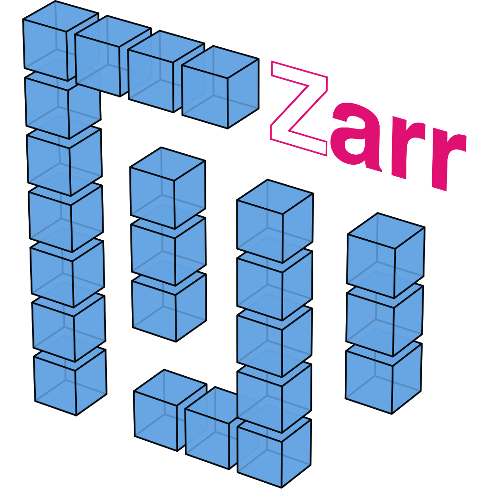
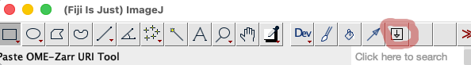
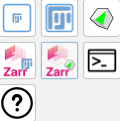
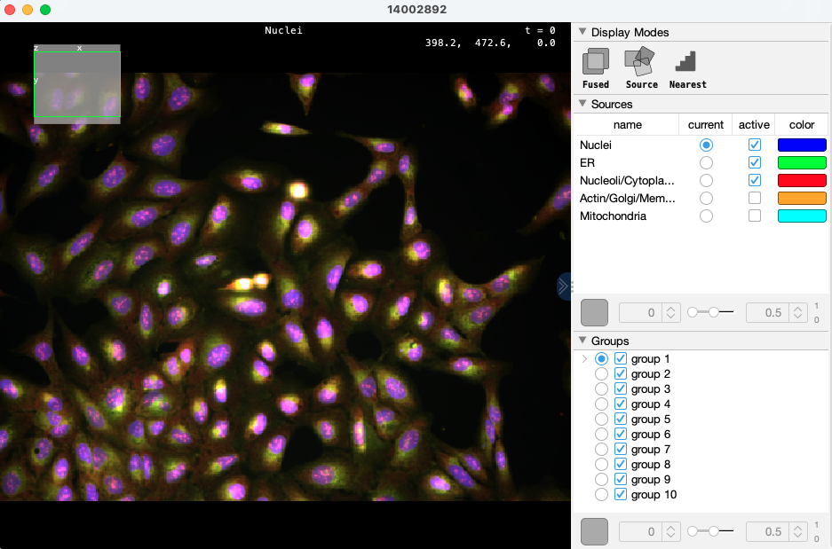
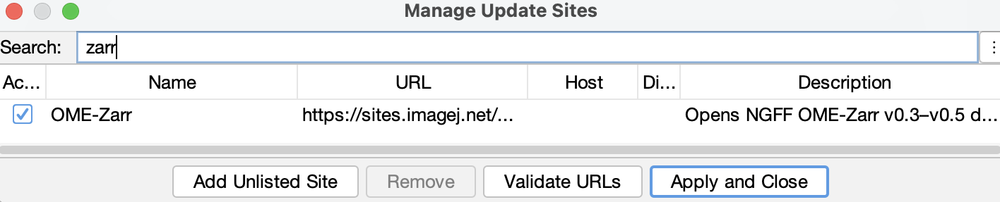

[](https://github.com/BioImageTools/ome-zarr-fiji-java/actions/workflows/build.yml)
[](https://opensource.org/licenses/BSD-2-Clause)
[](https://doi.org/10.5281/zenodo.19567191)
[](https://sonarcloud.io/summary/overall?id=BioImageTools_ome-zarr-fiji-java)
[](https://sonarcloud.io/summary/overall?id=BioImageTools_ome-zarr-fiji-java)



### Table of contents

- [About](#about)
- [Features](#features)
    - [How to open an OME-Zarr](#how-to-open-an-ome-zarr)
        - [Drag & Drop of local OME-Zarr folders and URIs](#drag--drop-of-local-ome-zarr-folders-and-uris)
        - [Copy & Paste of OME-Zarr URIs (local folder, http, https, s3)](#copy--paste-of-ome-zarr-uris-local-folder-http-https-s3)
        - [Open via menu (local folders)](#open-via-menu-local-folders)
        - [Open as `Dataset` (scripting)](#open-as-dataset-scripting)
        - [FIJI links (`fiji://`)](#fiji-links-fiji)
    - [Opening Behavior Settings](#opening-behavior-settings)
        - [Default opening behavior](#default-opening-behavior)
            - [Selection dialog (Ask me every time)](#selection-dialog-ask-me-every-time)
        - [Preferred width](#preferred-width)
        - [Reader backend](#reader-backend)
    - [Scriptlet support](#scriptlet-support)
    - [What is read and displayed](#what-is-read-and-displayed)
        - [Multi-resolution vs. single-resolution](#multi-resolution-vs-single-resolution)
        - [Supported OME-Zarr versions](#supported-ome-zarr-versions)
        - [Read channel information from OME-Zarr metadata](#read-channel-information-from-ome-zarr-metadata)
        - [Dual dataset view](#dual-dataset-view)
- [Known issues](#known-issues)
- [Example data](#example-data)
- [Availability](#availability)
    - [Fiji Update Site](#fiji-update-site)
    - [Manual installation](#manual-installation)
        - [Third-party jars](#third-party-jars)
- [For developers](#for-developers)
- [History](#history)

# About

A convenience layer for using **OME-Zarr** in Fiji/ImageJ. Open a dataset the way you would open any image: drag it
in, paste a URI, use the menu, or call it from a script. Support local and remote (https/s3) stores.

If the dropped / pasted / linked target is not recognized as a **OME-Zarr v0.3 - v0.5** resource, it does nothing.

# Features

## How to open an OME-Zarr

### Drag & Drop of local OME-Zarr folders and URIs

Drop a local OME-Zarr folder or an OME-Zarr URI onto Fiji. What happens next is set in the
[Opening Behavior Settings](#opening-behavior-settings).

### Copy & Paste of OME-Zarr URIs (local folder, http, https, s3)

* Supports local paths, http(s) URLs, and `s3://` URIs
    * Public (anonymous) S3 buckets work out of the box, e.g.
      `s3://janelia-cosem-datasets/jrc_mus-choroid-plexus-3/jrc_mus-choroid-plexus-3.zarr/recon-1/em/fibsem-uint8`.
    * Private buckets use your ambient AWS credentials (environment variables, `~/.aws/credentials`,
      instance profile, etc.); if those are absent, access falls back to anonymous.
    * The AWS region defaults to `us-east-1`.
* Three entry points:
    * Paste with `CTRL` / `CMD` / `SHIFT` + `V` (requires FIJI latest)
    * Paste via menu: Plugins -> OME-Zarr -> Paste OME-Zarr URI
    * Paste via button in FIJI: 

### Open via menu (local folders)

`File -> Import -> OME-Zarr...` opens a folder chooser. The selected folder is checked for Zarr metadata and then opened
with the same opening behavior, resolution and reader backend as drag & drop and paste. Being a single-parameter SciJava
command, it is macro-recordable:

```
run("OME-Zarr...", "directory=/path/to/image.ome.zarr");
```

Only local folders can be chosen here; for http(s) and `s3://` locations use copy & paste.

### Open as `Dataset` (scripting)

`Plugins -> OME-Zarr -> Open OME-Zarr as Dataset` takes the location as a single line of text and hands the image back
as a `Dataset` output, so a macro or script can keep working with it:

```
run("Open OME-Zarr as Dataset", "uri=/path/to/image.ome.zarr");
```

Unlike the `File -> Import` entry it accepts local paths, `file:` and `http(s):` URIs, and it always produces a
`Dataset` instead of following the configured open behavior. The reader backend still comes from the
settings. `s3://` is not supported here. The command opens no dialog of its own.

### FIJI links (`fiji://`)

A `fiji://` link on a web page opens an OME-Zarr in Fiji, honoring the same
[default opening behavior](#default-opening-behavior) as drag & drop and paste. It needs Fiji-Latest with the [OME-Zarr update site](#fiji-update-site). A link such as

```
fiji://open/url?p=https://livingobjects.ebi.ac.uk/idr/zarr/v0.5/idr0033A/BR00109990_C2.zarr/0
```

opens that dataset. Use `open/file?p=` for a local path and `open/source?p=` to let Fiji detect the source type.
`s3://` targets do **not** work through links — paste those instead ([see above](#copy--paste-of-ome-zarr-uris-local-folder-http-https-s3)).

What a click does currently depends on the operating system:

| OS             | Fiji not running             | Fiji already running                |
|----------------|------------------------------|-------------------------------------|
| macOS          | starts Fiji, opens the image | opens the image in the running Fiji |
| Windows, Linux | starts Fiji, opens the image | starts a **second** Fiji            |

This is a known `fiji-links` limitation. Making Windows and Linux reuse the running Fiji, as macOS does, is planned.

Fiji-Latest registers itself for Fiji links automatically. If you have several Fiji installations, or the links do not
work, check the *Enable web links* setting in `Edit -> Options -> Desktop...`:

* **Windows, Linux:** *Enable web links* is a checkbox. Tick it in the Fiji installation that should handle the links.
* **macOS:** the dialog only reports that web links are always enabled. There is nothing to change. With several
  installations, the link opens whichever one macOS has associated with `fiji://`.

See [doc/fiji-links-demo.html](https://htmlpreview.github.io/?https://raw.githubusercontent.com/BioImageTools/ome-zarr-fiji-java/main/doc/fiji-links-demo.html)
for a page with clickable examples of each form.

## Opening Behavior Settings

`Plugins -> OME-Zarr -> Settings -> Opening Behavior Settings` sets three things, kept across Fiji sessions: the
[default opening behavior](#default-opening-behavior), the [preferred width](#preferred-width) and the
[reader backend](#reader-backend). They apply to drag & drop, copy & paste,
`File -> Import -> OME-Zarr...` and `fiji://` links.

### Default opening behavior

What Fiji does with a dropped / pasted / linked OME-Zarr. The options shipped here are:

* **ImageJ (preferred resolution)** (initial default): opens the highest single-resolution level that is not wider
  than the [preferred width](#preferred-width). This avoids loading excessively large images.
* **ImageJ (highest resolution)**: opens the highest-resolution level in ImageJ.
* **BigDataViewer**: opens all resolution levels as a multi-resolution source. This is useful for large OME-Zarrs.
  Channel names, colors, contrast limits, and the time point are
  [taken from the OME-Zarr metadata](#read-channel-information-from-ome-zarr-metadata), if available.
* **N5 importer dialog**: opens the N5 import dialog at the dropped OME-Zarr. It lists the resolution levels, lets you
  choose one, possibly crop it, and opens it in ImageJ.
* **N5 viewer dialog**: opens the N5 viewer dialog at the dropped OME-Zarr. It lists the resolution levels, lets you
  choose one or the full pyramid, and opens it in BigDataViewer.
* **Script editor**: runs a [user script](#scriptlet-support) (e.g., a macro) on the dropped OME-Zarr, so you can
  define your own action.
* **Ask me every time**: shows the [selection dialog](#selection-dialog-ask-me-every-time) instead.

The list is not fixed: any Fiji plugin can [register its own opener](doc/DEVELOPERS.md#registering-your-own-opener),
and it then appears here and in the dialog next to the built-in ones.

#### Selection dialog (Ask me every time)



The dialog shows one icon button per registered opener, i.e., the options above, plus a help button.

### Preferred width

The maximum image width, in pixels, for **ImageJ (preferred resolution)** (default: 1000). Fiji picks the highest
resolution level of the pyramid whose width is below this value.

### Reader backend

We support two backends for reading OME-Zarrs:

* [Zarr-java](https://github.com/zarr-developers/zarr-java) (default)
    * may be a bit quicker when opening remote resources.
    * only supports OME-Zarr v0.4 and v0.5, not v0.3.
* [N5 library](https://github.com/saalfeldlab/n5)
    * shipped with Fiji, and the only one that reads OME-Zarr v0.3.

## Scriptlet support

* Users can run a script on the OME-Zarr, via the **Script editor** opening behavior. The script resource can be a file
  and can be set in the `Plugins -> OME-Zarr -> Settings -> User Script Settings` menu.
* If no script is set, the script editor opens with a default script.

## What is read and displayed

### Multi-resolution vs. single-resolution

* Users can drag & drop / copy & paste a top-level OME-Zarr folder, which contains a multi-resolution dataset. It will
  be opened as multi-resolution data.
* Users can also drag & drop / copy & paste a subfolder of the top-level OME-Zarr folder (i.e., single-resolution data).

### Supported OME-Zarr versions

| OME-Zarr                                               | Zarr | Supported                                               |
|--------------------------------------------------------|------|---------------------------------------------------------|
| [v0.5](https://ngff.openmicroscopy.org/0.5/index.html) | v3   | ✓                                                      |
| [v0.4](https://ngff.openmicroscopy.org/0.4/index.html) | v2   | ✓                                                      |
| [v0.3](https://ngff.openmicroscopy.org/0.3/index.html) | v2   | ✓ [N5 backend](#reader-backend) only, i.e. Fiji-Latest |
| ≤ v0.2                                                 | v2   | ✗                                                      |

Images may be 2D (xy), 3D (xyc, xyt, xyz), 4D (xyct, xyzc, xyzt) or 5D (xyzct).

| Feature                                                              | Supported                                                                            |
|----------------------------------------------------------------------|--------------------------------------------------------------------------------------|
| Multiscale images (resolution pyramids)                              | ✓                                                                                   |
| Single-scale images (one level of a pyramid, or a bare array)        | ✓ see [below](#multi-resolution-vs-single-resolution)                               |
| Zipped OME-Zarr archives (`.ozx`)                                    | ✓ zarr-java backend only                                                            |
| `multiscales` metadata: resolution levels, axis scales, units        | ✓                                                                                   |
| `omero` metadata: channel names, colors, contrast limits, time point | ✓ BigDataViewer only, see [below](#read-channel-information-from-ome-zarr-metadata) |
| Labels                                                               | ✗                                                                                   |
| High-content screening (HCS): plates and wells                       | ✗                                                                                   |
| bioformats2raw layout (several images in one Zarr)                   | ✗                                                                                   |
| Scenes (OME-Zarr v0.6)                                               | ✗                                                                                   |

### Read channel information from OME-Zarr metadata

* The channel names, colors, and contrast limits and their active/inactive state are automatically extracted from the
  OME-Zarr metadata, if available. The time point is also automatically set to the time point specified in the metadata,
  if available.
* Works only when a multi-resolution OME-Zarr is drag & dropped / copy & pasted and opened in BigDataViewer.



### Dual dataset view

* Fiji memorizes the full context of a drag & dropped / copy & pasted OME-Zarr. That said, even if the OME-Zarr is
  opened as a particular resolution in ImageJ via drag & drop / copy & paste, one can still open it in BigDataViewer
  using all resolution pyramids (via `Plugins > OME-Zarr > Open Current OME-Zarr Image in BigDataViewer`).
* Or the opposite, even if the dropped / pasted OME-Zarr has right away landed in BigDataViewer, it is possible to
  display a particular resolution of it as Dataset in ImageJ (via `Plugins > OME-Zarr > Open Current OME-Zarr Image in ImageJ...`).
  Images which support swithing resolutions are displayed carry `(R=l/n)` in their name to indicate this property, `l`
  being the shown resolution level (1 = highest resolution) and `n` the number of resolution levels.
* Both views share the same pixel data, so an edit in ImageJ (e.g. *Edit > Fill*) also shows up in BigDataViewer —
  once you move to another channel, slice or time point in ImageJ and BigDataViewer redraws (e.g. after panning).
  Only the edited resolution level changes, and edits live in memory only: they are not saved to the OME-Zarr and
  may be lost when Fiji frees memory.
* To sum it up, once OME-Zarr is in Fiji, users don't have to drop / paste it again to display it differently. This is a
  great way to save RAM (memory) on your computer.

# Known issues

* Reading of OME-Zarrs version <= 0.2 is not supported. With the zarr-java backend, only OME-Zarr v0.4 and v0.5 are
  supported, not v0.3.
* Several features need Fiji-Latest. If you hit one of them on Fiji-Stable, please switch to
  [Fiji-Latest](https://imagej.net/software/fiji/downloads).

| Feature                                       | Fiji-Latest | Fiji-Stable | Why                                                                                                                                                                      |
|-----------------------------------------------|:-----------:|:-----------:|--------------------------------------------------------------------------------------------------------------------------------------------------------------------------|
| Drag & drop, dialogs, opening in ImageJ / BDV |     ✓      |     ✓      |                                                                                                                                                                          |
| zarr-java backend (the default)               |     ✓      |     ✓      | shipped via the OME-Zarr update site                                                                                                                                     |
| N5 backend, and thus OME-Zarr v0.3            |     ✓      |     ✗      | Fiji-Stable's N5 jars are too old. Updating them by hand (see [manual installation](#n5-backend)) works but breaks other plugins that depend on N5, e.g. **BigStitcher** |
| `s3://` URIs                                  |     ✓      |     ✗      | no AWS SDK in Fiji-Stable; reported as a message when you try                                                                                                            |
| Paste with `CTRL` / `CMD` / `SHIFT` + `V`     |     ✓      |     ✗      | the keyboard hook needs a newer SciJava; use the menu or the toolbar button instead                                                                                      |
| `fiji://` links                               |     ✓      |     ✗      | the handler (`fiji-links`) ships with Fiji-Latest only                                                                                                                   |
| Blosc-compressed OME-Zarrs on macOS           |     ✓      |     ✗      | the older stack cannot load the native Blosc library                                                                                                                     |

# Example data

* There are some OME-Zarr example datasets in the image data repository. You can download them
  from [here](https://idr.github.io/ome-ngff-samples/) to your local machine to test the drag & drop.
* A zipped OME-Zarr archive (`.ozx`, 38 MB): [6001240.ozx](https://static.webknossos.org/misc/6001240.ozx).
  Open it with `File -> Import -> OME-Zarr Archive (.ozx)...`, or drag & drop the downloaded file. Archives are
  read by the zarr-java backend only.

# Availability

## Fiji Update Site

Enable the Fiji update site [OME-Zarr](https://sites.imagej.net/OME-Zarr/) in the
`Help -> Update -> Manage Update Sites`:



## Manual installation

Check out the repo and compile with:

```
mvn clean package
```

All jars mentioned below go into your Fiji installation's `jars` folder, unless noted otherwise.

The build is a multi-module reactor and produces five jars — one per module. Copy **all five** into that `jars` folder:

* `ome-zarr-imglib2/target/ome-zarr-imglib2-<version>.jar`
* `ome-zarr-n5/target/ome-zarr-n5-<version>.jar`
* `ome-zarr-zarrjava/target/ome-zarr-zarrjava-<version>.jar`
* `ome-zarr-fiji/target/ome-zarr-fiji-<version>.jar`
* `ome-zarr-fiji-ui/target/ome-zarr-fiji-ui-<version>.jar`

### Third-party jars

On top of those five, a number of third-party `.jar` files are needed. Which ones depends on the
[reader backend](#reader-backend) you want to use:

* **N5 backend** needs the N5 library stack (`n5`, `n5-universe`, `n5-zarr`) plus the Fiji
  plugin `n5-viewer_fiji`.
    * **Fiji-Latest** ships these artifacts, so there is usually nothing to do.
    * **Fiji-Stable** ships older versions that have to be updated to the ones listed below. Be aware that other Fiji
      plugins depend on N5 as well, e.g. BigStitcher. Thus, updating the N5 jars in a Fiji-Stable installation may
      break them. If you can, use Fiji-Latest, or keep a separate Fiji installation for OME-Zarr work.
* **zarr-java backend** (the default) needs `zarr-java` 0.3.0 and two of its dependencies (the Blosc codec and a
  Jackson module), none of which Fiji ships.

#### N5 backend

* [n5-4.0.1](https://maven.scijava.org/repository/releases/org/janelia/saalfeldlab/n5/4.0.1/n5-4.0.1.jar)
* [n5-aws-s3-5.0.1](https://maven.scijava.org/repository/releases/org/janelia/saalfeldlab/n5-aws-s3/5.0.1/n5-aws-s3-5.0.1.jar)
* [n5-blosc-2.0.0](https://maven.scijava.org/repository/releases/org/janelia/saalfeldlab/n5-blosc/2.0.0/n5-blosc-2.0.0.jar)
* [n5-google-cloud-6.0.1](https://maven.scijava.org/repository/releases/org/janelia/saalfeldlab/n5-google-cloud/6.0.1/n5-google-cloud-6.0.1.jar)
* [n5-hdf5-3.0.0](https://maven.scijava.org/repository/releases/org/janelia/saalfeldlab/n5-hdf5/3.0.0/n5-hdf5-3.0.0.jar)
* [n5-ij-5.0.0](https://maven.scijava.org/repository/releases/org/janelia/saalfeldlab/n5-ij/5.0.0/n5-ij-5.0.0.jar)
* [n5-imglib2-8.0.0](https://maven.scijava.org/repository/releases/org/janelia/saalfeldlab/n5-imglib2/8.0.0/n5-imglib2-8.0.0.jar)
* [n5-universe-3.0.2](https://maven.scijava.org/repository/releases/org/janelia/saalfeldlab/n5-universe/3.0.2/n5-universe-3.0.2.jar)
* [n5-zarr-2.0.1](https://maven.scijava.org/repository/releases/org/janelia/saalfeldlab/n5-zarr/2.0.1/n5-zarr-2.0.1.jar)
* [n5-zstandard-2.0.0](https://maven.scijava.org/repository/releases/org/janelia/n5-zstandard/2.0.0/n5-zstandard-2.0.0.jar)
* [n5-viewer_fiji-6.2.0](https://maven.scijava.org/repository/releases/org/janelia/saalfeldlab/n5-viewer_fiji/6.2.0/n5-viewer_fiji-6.2.0.jar) —
  goes into `plugins`, not `jars`, because it is itself a Fiji plugin

#### zarr-java backend

* [zarr-java-0.3.0](https://repo1.maven.org/maven2/dev/zarr/zarr-java/0.3.0/zarr-java-0.3.0.jar)
* [blosc-java-0.3-1.21.6](https://repo1.maven.org/maven2/com/scalableminds/blosc-java/0.3-1.21.6/blosc-java-0.3-1.21.6.jar) —
  dependency of `zarr-java` (Blosc codec)
* [jackson-datatype-jdk8-2.20.0](https://repo1.maven.org/maven2/com/fasterxml/jackson/datatype/jackson-datatype-jdk8/2.20.0/jackson-datatype-jdk8-2.20.0.jar) —
  dependency of `zarr-java`

Delete older versions of an artifact when you add a newer one.

Note that two options of the [dialog](#selection-dialog-ask-me-every-time) — the ones opening the **N5 Importer** and the **N5 Viewer** —
are implemented using `n5-ij` and `n5-viewer_fiji`, so the N5 jars are also needed when the zarr-java
backend is selected.

# For developers

[**doc/DEVELOPERS.md**](doc/DEVELOPERS.md) covers using this project as a library rather than as a plugin:

* [which of the five modules to depend on](doc/DEVELOPERS.md#which-module-do-i-depend-on)
* [`PyramidContents<T>`](doc/DEVELOPERS.md#reading-a-dataset-pyramidcontentst), the object you get after reading, and
  its lazy cell images
* [one read, two views](doc/DEVELOPERS.md#one-read-two-views) — the same pyramid in ImageJ and in BigDataViewer
* [opening with the user's settings](doc/DEVELOPERS.md#opening-the-way-the-user-configured-it) from your own plugin
* [registering your own opener](doc/DEVELOPERS.md#registering-your-own-opener)

# History

* 2025: Moved under this github organization
  from [previous URL https://github.com/xulman/ome-zarr-fiji-ui](https://github.com/xulman/ome-zarr-fiji-ui). Code state
  is [here](https://github.com/BioImageTools/ome-zarr-fiji-java/releases/tag/ome-zarr-fiji-java-0.2.0).
* 2024: Project revamped and based solely on [the suite of libs around the N5](https://github.com/saalfeldlab/n5).
* 2024:
  [OME-NGFF Workflows Hackathon 2024](https://biovisioncenter.notion.site/OME-NGFF-Workflows-Hackathon-2024-dde32a032adf49b4a53b4b014586b678)
  in Zurich.
* 2024: [CZI grant about "OME-Zarr Support for Java/Fiji"](https://chanzuckerberg.com/eoss/proposals/?cycle=6) landed
  at [CEITEC](https://www.ceitec.eu/).
* 2023: Changes in the [scijava land](https://github.com/scijava) towards more generic drag & drop handlers.
* 2022: It started at
  the ["Fiji + NGFF Hackathon" in Prague](https://forum.image.sc/t/fiji-ngff-hackathon-sep-2022-prague-cze/69191). Code
  state is [here](https://github.com/BioImageTools/ome-zarr-fiji-java/releases/tag/2022-Prague-hackathon) and version
  with revived code demo
  is [here](https://github.com/BioImageTools/ome-zarr-fiji-java/releases/tag/revived-prague-code-demo).
