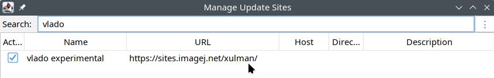

[](https://github.com/BioImageTools/ome-zarr-fiji-java/actions/workflows/build.yml)
[](https://opensource.org/licenses/BSD-2-Clause)
[](https://sonarcloud.io/summary/overall?id=BioImageTools_ome-zarr-fiji-java)
[](https://sonarcloud.io/summary/overall?id=BioImageTools_ome-zarr-fiji-java)

# About


This repo is currently primarily only a scijava (Fiji) drag-and-drop handler for OME-Zarrs.

An outcome of this handler is three-fold:

- It either doesn't recognize the dropped target as Zarr v3 and does nothing; or else
- It opens the N5 Import dialog (which is also available under "Fiji -> File -> Import -> HDF5/N5/Zarr/NGFF..."), unless
- It was an ALT + drag-and-drop (the ALT key was held down) in which
  case [BigDataViewer](https://imagej.net/plugins/bdv/) is opened directly.

# Availability

Either compile yourself, just:

```
mvn clean package
```

and place the `.jar` file into your `Fiji.app/jars`. Or, enable the open, experimental,
and thus not listed Fiji update site `https://sites.imagej.net/xulman/`:



# History

* 2025: Moved under this github organization
  from [previous URL https://github.com/xulman/ome-zarr-fiji-ui](https://github.com/xulman/ome-zarr-fiji-ui).
* 2024: Project revamped and based solely on [the suite of libs around the N5](https://github.com/saalfeldlab/n5).
*

2024: [OME-NGFF Workflows Hackathon 2024](https://biovisioncenter.notion.site/OME-NGFF-Workflows-Hackathon-2024-dde32a032adf49b4a53b4b014586b678)
in Zurich.

* 2024: [CZI grant about "OME-Zarr Support for Java/Fiji"](https://chanzuckerberg.com/eoss/proposals/?cycle=6) landed
  at [CEITEC](https://www.ceitec.eu/).
* 2023: Changes in the [scijava land](https://github.com/scijava) towards more generic drag-and-drop handlers.
* 2022: It started at
  the ["Fiji + NGFF Hackathon" in Prague](https://forum.image.sc/t/fiji-ngff-hackathon-sep-2022-prague-cze/69191).

# Outlook

This is a brief outline of what [@xulman](https://github.com/xulman/) would
like to have in Fiji so that the usual Fiji pipelines (meaning the standard
ImageJ macros, Jython scripts, and even GUI-operated plugins) could work with
Zarrs and benefit from their chunk-based nature. It is greatly inspired by his
[previous work on DataStore](https://github.com/fiji-hpc/hpc-datastore/), which
is
essentially [a suite of Fiji plugins](https://github.com/fiji-hpc/hpc-datastore/blob/master/doc/DESCRIPTION.md#clients)
to manage (create, modify and delete full datasets, read and write images or
even their
chunks) [a http-servered N5 datasets](https://github.com/fiji-hpc/hpc-datastore/blob/master/doc/DESCRIPTION.md).

So, we basically need a suite of Fiji (in fact scijava) plugins that (are
“headless” and) all of them would take an URI to some NGFF data plus specific
parameters depending on a particular function/purpose of a plugin. Examples are
a query plugin, that tells how many time points are available at a given URI,
or how many channels are available, or a plugin that can read a full image at a
given time point and a given channel from URI etc. Using these, it is easy to
construct e.g. a for-loop over all time points to process an image (at variable
time point and fixed particular channel) one after another. To optimize the
work with a particular URI, a scijava service (we could call it `NgffService`)
should work in conjunction with these plugins. Note that a scijava service is a
singleton object that lives uninterruptedly within Fiji; it is opened and
closed automatically with Fiji. That way, the commands/plugins are “routed”
through the `NgffService`, which could implement caching (with time-limited
memory) so that e.q. repetitive queries will need not to inspect/talk to the
URI-pointed place (e.g. folder, or remote resource); only the first query will
be “expensive” in this way. At the heart should be a public Java API —
interfaces. Currently, the first implementation is planned using the
[n5 library](https://github.com/saalfeldlab/n5).
The `NgffService` should wrap around these interfaces.

The plugins would basically outsource their work to the `NgffService`,
and they could look roughly like this:

```
@Plugin(type = Command.class, menuPath = "Plugins>OME-Zarr>Read Image")
public class OmeZarrReadImage implements Command {
	@Parameter
	NgffService ngff;

	@Parameter
	String URI;

	/* More params specifying which image to read in particular */

	@Parameter(type = ItemIO.OUTPUT)
	Dataset ds;

	@Override
	public void run() {
		Img<?> img = ngff.read(URI, /* params */);
		//create 'ds' around the obtained 'img'
		//plus the usual 'try-catch', you know ;-)
	}
}
```

Such plugins are directly available via Fiji menus, are (or can be made)
macro recordable, accessible in the standard ImageJ macros and Jython scripts;
the `NgffService` can be also directly accessible in the Jython scripts. In
fact, these are cheap “side-effects” of the great [scijava universe](https://github.com/scijava).

The first version is expected to be delivered in 2025.
