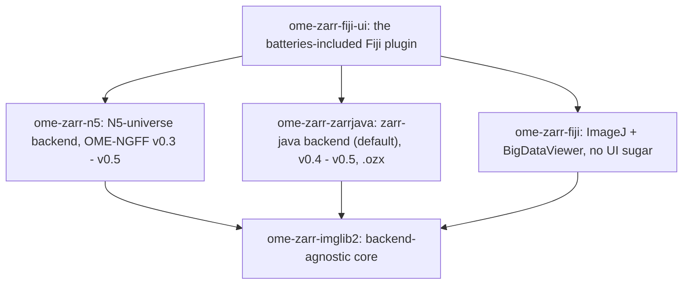
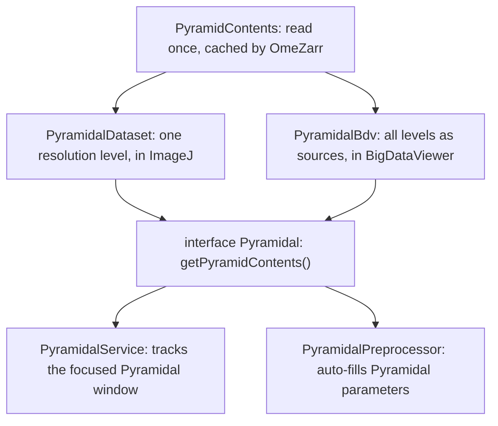
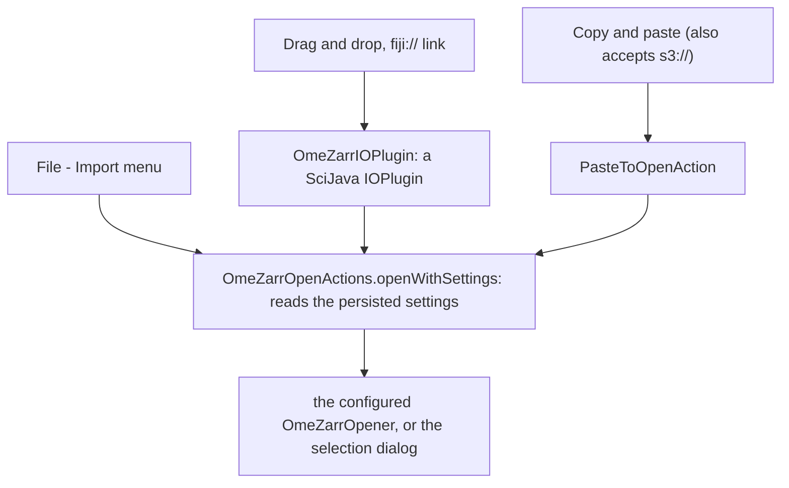
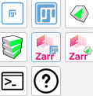
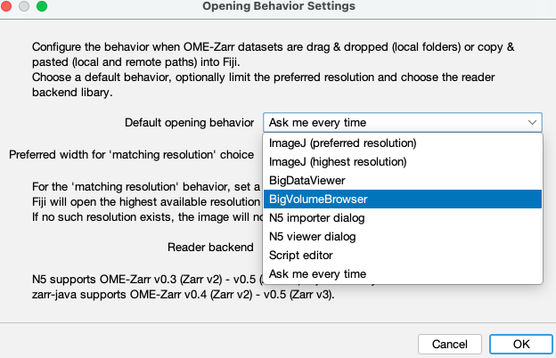
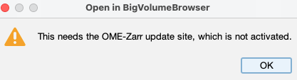

# Developer documentation

For two kinds of developers:

* you want to **read OME-Zarr in your own Java code**, with or without
  Fiji → [the core](#reading-a-dataset-pyramidcontentst)
* you write a **Fiji plugin** that should show OME-Zarr images
  → [ImageJ and BigDataViewer](#one-read-two-views)
  and [opening with the user's settings](#opening-the-way-the-user-configured-it)
* you write a **Fiji plugin that opens OME-Zarrs its own way** and should appear next to ImageJ and BigDataViewer
  → [registering your own opener](#registering-your-own-opener)

Everything below is the state of **0.9.0**.

## Contents

- [Which module do I depend on?](#which-module-do-i-depend-on)
- [Reading a dataset: `PyramidContents<T>`](#reading-a-dataset-pyramidcontentst)
- [One read, two views](#one-read-two-views)
- [Opening the way the user configured it](#opening-the-way-the-user-configured-it)
- [Registering your own opener](#registering-your-own-opener)

# Which module do I depend on?



`ome-zarr-imglib2`, `ome-zarr-n5` and `ome-zarr-zarrjava` are plain Java — **no Fiji, so headless use works**.

| Module              | Packages                                              | Purpose                                                                                                                                                                         | Depends on                                                                           |
|---------------------|-------------------------------------------------------|---------------------------------------------------------------------------------------------------------------------------------------------------------------------------------|--------------------------------------------------------------------------------------|
| `ome-zarr-imglib2`  | `ome.zarr.imglib2` `.metadata` `.exceptions`          | Backend-agnostic core: data model, OME-NGFF metadata, Zarr detection. No Fiji, no backend library.                                                                              | imglib2, imglib2-cache, imglib2-realtransform, gson                                  |
| `ome-zarr-n5`       | `ome.zarr.n5`                                         | N5-universe backed reader, OME-Zarr v0.3 – v0.5.                                                                                                                                | `ome-zarr-imglib2`, the N5 stack                                                     |
| `ome-zarr-zarrjava` | `ome.zarr.zarrjava`                                   | zarr-java backed reader (the default), Zarr v2/v3 i.e. OME-Zarr v0.4 + v0.5. The only backend that reads `.ozx` archives.                                                       | `ome-zarr-imglib2`, `dev.zarr:zarr-java`                                             |
| `ome-zarr-fiji`     | `ome.zarr.fiji` `.read` `.open` `.plugins` `.util`    | Opens a pyramid in ImageJ or BigDataViewer, tracks the active window, and defines the `OmeZarrOpener` extension point. No dialogs, no backend dependency — pick one at runtime. | `ome-zarr-imglib2`, bigdataviewer-core, spim_data, imagej-common, ij, scijava-common |
| `ome-zarr-fiji-ui`  | `ome.zarr.fijiui` `.open` `.plugin` `.dialog` `.util` | The shipped plugin: `IOPlugin`, clipboard, Swing dialogs, SciJava commands, persisted settings, the six built-in openers.                                                       | the four above, scijava-common, script-editor, n5-viewer_fiji                        |

Pick the smallest one you need:

* a headless Java tool → `ome-zarr-imglib2` **plus one backend**
* a Fiji plugin that displays images → `ome-zarr-fiji`
* a Fiji plugin that only registers an opener → `ome-zarr-fiji` (not `-ui`)
* end users → install `ome-zarr-fiji-ui` via the [update site](../README.md#fiji-update-site)

`ome-zarr-fiji` and `ome-zarr-imglib2` have **no compile-time dependency on a backend**, but need at least one of them
on the classpath at runtime.

Releases are published to the SciJava Nexus, **not** to Maven Central, so add the repository:

```xml

<repositories>
	<repository>
		<id>scijava.public</id>
		<url>https://maven.scijava.org/content/groups/public</url>
	</repository>
</repositories>

<dependency>
<groupId>ome.zarr</groupId>
<artifactId>ome-zarr-imglib2</artifactId>
<version>0.9.0</version>
</dependency>
<dependency>
<groupId>ome.zarr</groupId>
<artifactId>ome-zarr-zarrjava</artifactId>
<version>0.9.0</version>
</dependency>
```

The other artifactIds are `ome-zarr-n5`, `ome-zarr-fiji` and `ome-zarr-fiji-ui`.

# Reading a dataset: `PyramidContents<T>`

One interface, one method:

```java
public interface PyramidBackend
{
	< T extends NativeType< T > & RealType< T > > PyramidContents< T > read( URI inputUri );

	default String getName();   // "N5", "zarr-java" — for user-facing messages
}
```

`PyramidContents<T>` is what you get back, and it is immutable — public final fields, no setters:

|                        |                                                                                                                                        |
|------------------------|----------------------------------------------------------------------------------------------------------------------------------------|
| **Pixel data**         | `cachedCellImgs[]` (one per resolution level), `type`, `name`                                                                          |
| **Visualisation data** | `transforms[]`, `axesPerLevel[][]`, `omero`, `hasPlaceholderCalibration`                                                               |
| **Levels**             | `asImg()` (= level 0) · `asLargestImg()` · `asSmallestImg()` · `asImg(int)` · `numResolutionLevels()` · `smallestResolutionLevel()`    |
| **Level selection**    | `suggestResolutionLevel(Integer preferredMaxWidth)`                                                                                    |
| **Shape by axis name** | `hasAxis("z")` · `axisIndex("c")` · `sizeAlongAxis("t")` · `numDimensions()` · `numChannels()` · `numTimepoints()` · `channelLabels()` |

**Cell images are lazy** — nothing is fetched until a chunk is touched, so reading a remote pyramid is cheap and the
cost arrives when you traverse pixels.

`suggestResolutionLevel` returns `NO_MATCHING_LEVEL` (`-1`) when no level is narrow enough instead of silently picking
one; the caller decides.

```java
URI uri = URI.create( "https://livingobjects.ebi.ac.uk/idr/zarr/v0.5/idr0033A/BR00109990_C2.zarr/0" );

// one-call entry point; N5PyramidBackend.readPyramid( uri ) is the other backend
PyramidContents< UnsignedByteType > contents = ZarrJavaPyramidBackend.readPyramid( uri );
Img< UnsignedByteType > img = contents.asImg();                  // full resolution, still lazy

long width = contents.sizeAlongAxis( AxisCalibration.X );
int level = contents.suggestResolutionLevel( 1000 );             // may be NO_MATCHING_LEVEL
if ( level != PyramidContents.NO_MATCHING_LEVEL )
	img = contents.asImg( level );
```

Instantiating the backend does the same and lets you keep it around:

```java
PyramidBackend backend = new ZarrJavaPyramidBackend();           // or new N5PyramidBackend()
PyramidContents< ? > contents = backend.read( uri );
```

# One read, two views

`ome-zarr-fiji` reads **once** and wraps the same `PyramidContents` into either view. Both implement `Pyramidal`, which
is what lets an image travel between ImageJ and BigDataViewer with no second read and no second copy in RAM.

Such an image is marked as `(R=l/n)` in its name — `R` for the `n` **resolution levels** it still carries, and hence for
being able to switch between them; `l` is the level shown, counted from 1 as in the level dialog (the `PyramidalDataset`
constructor appends it).



`OmeZarr` is the handle: a URI, a `Context`, a backend, and optionally a preferred maximum width and an error sink (pass
a non-interactive one for headless use).

```java
Context context = new Context();   // in a plugin, get it injected instead
URI uri = URI.create( "https://livingobjects.ebi.ac.uk/idr/zarr/v0.5/idr0033A/BR00109990_C2.zarr/0" );
OmeZarr omeZarr = new OmeZarr( uri, context, new ZarrJavaPyramidBackend(), 1000 );

// the direct ways — both return what they showed, or null if it failed / the user declined
PyramidalDataset dataset = omeZarr.showInImageJ();
BdvHandle bdv = omeZarr.showInBdv();

// or read without showing anything
PyramidalDataset ds = omeZarr.readPyramidalDataset();
PyramidContents< ? > contents = omeZarr.readContents();   // read once, then cached

// or build the BDV sources yourself
PyramidalBdv< ? > pyramidal = new PyramidalBdv<>( context, omeZarr.readContents() );
List< ? extends SourceAndConverter< ? > > sources = pyramidal.asSources();
```

Because `omeZarr.readContents()` caches, sharing one `OmeZarr` instance means the pyramid is read once no matter how
many views you build from it.

To get a **single resolution level** out of an `OmeZarr` as a plain ImgLib2 image, without opening a window, go through
`readContents()`:

```java
OmeZarr omeZarr = new OmeZarr( uri, context, backend );
PyramidContents< ? > contents = omeZarr.readContents();
Img< ? > img = contents.asImg( level );   // 0 = full resolution
```

`numResolutionLevels()`, `smallestResolutionLevel()` and `suggestResolutionLevel( preferredMaxWidth )` pick `level`.

# Opening the way the user configured it

If your plugin has an OME-Zarr URI and simply wants Fiji to do whatever the user configured — opener, preferred width,
reader backend — that is one call:

```java
OmeZarrOpenActions.openWithSettings( uri, context );
```

Every user-facing entry route ends there:



Reading the settings without opening anything:

```java
OmeZarrOpeningSettings settings = OmeZarrOpeningSettings.loadSettingsFromPreferences( prefService );
PyramidBackend backend = settings.getBackend().createBackend();
int preferredWidth = settings.getPreferredMaxWidth();
```

# Registering your own opener

Your plugin can offer *itself* as a way to open OME-Zarrs: it then appears in the selection dialog, in the opening
behaviour settings, and can become the default. It takes one annotated class in your own jar and a dependency on
`ome-zarr-fiji` — **not** on `-ui`.

```java

@Plugin(
		type = OmeZarrOpener.class, name = "my-opener", label = "My viewer",
		description = "Open the OME-Zarr in My viewer",
		iconPath = "/icons/my-opener.png", priority = Priority.VERY_HIGH
)
public class MyOmeZarrOpener implements OmeZarrOpener
{
	@Override
	public void open( final OmeZarr omeZarr )
	{
		MyViewer.open( omeZarr.uri() );
	}
}
```

There is deliberately **no custom annotation**: `@Plugin` already carries everything, scijava-common indexes it in your
jar for free, and the icon is resolved out of the *contributing* jar.

| Annotation element     | What it does                                                                                                                                                                                                                                                   |
|------------------------|----------------------------------------------------------------------------------------------------------------------------------------------------------------------------------------------------------------------------------------------------------------|
| `name`                 | Identifies the opener in the persisted settings, so **keep it stable across releases**. The shipped ones are `imagej-preferred-resolution`, `imagej-highest-resolution`, `bdv-multi-resolution`, `n5-importer-dialog`, `n5-viewer-dialog` and `script-editor`. |
| `label`, `description` | What the user sees in the settings and as the button tooltip.                                                                                                                                                                                                  |
| `iconPath`             | Classpath path to the button icon in your jar.                                                                                                                                                                                                                 |
| `priority`             | Orders the openers, and decides which one a user who never configured a choice gets. The shipped openers sit at `Priority.HIGH` and below, so declare `Priority.VERY_HIGH` to be the out-of-the-box default.                                                   |

What the contract gives you:

* `open( OmeZarr )` is called **off the EDT**, so it may read and block.
* The `OmeZarr` carries the URI *and* the backend and preferred width the user configured. Bring your own reading code
  and `omeZarr.uri()` is all you need.
* Report failures through `omeZarr.errorHandler()` — they are yours to report.

## A worked example: BigVolumeBrowser

[BigVolumeBrowser](https://github.com/UU-cellbiology/bigvolumebrowser) registers itself this way
([PR #28](https://github.com/UU-cellbiology/bigvolumebrowser/pull/28)). Once its jar is on the classpath it shows up as
an icon button in the selection dialog.



…and in `Plugins > OME-Zarr > Settings > Opening Behavior Settings`, where it can be made the default:



**Survive being installed without us.** Your plugin and this one are installed independently, so handle the case where
the OME-Zarr update site is *not* activated. Any *menu command* of yours that touches our classes should
say so rather than throw:



Registering an opener may also get you into the shared-window story, e.g.
`Plugins > OME-Zarr > Open Current OME-Zarr Image in BigDataViewer` and
`Open Resolution Level...` act on that dataset **without reading it again** (see
[One read, two views](#one-read-two-views)).

